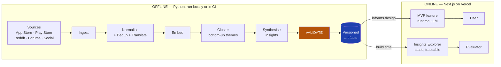
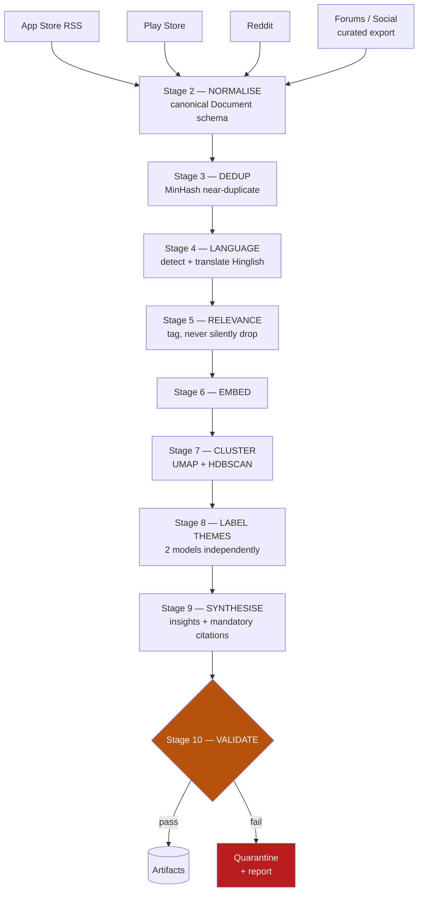
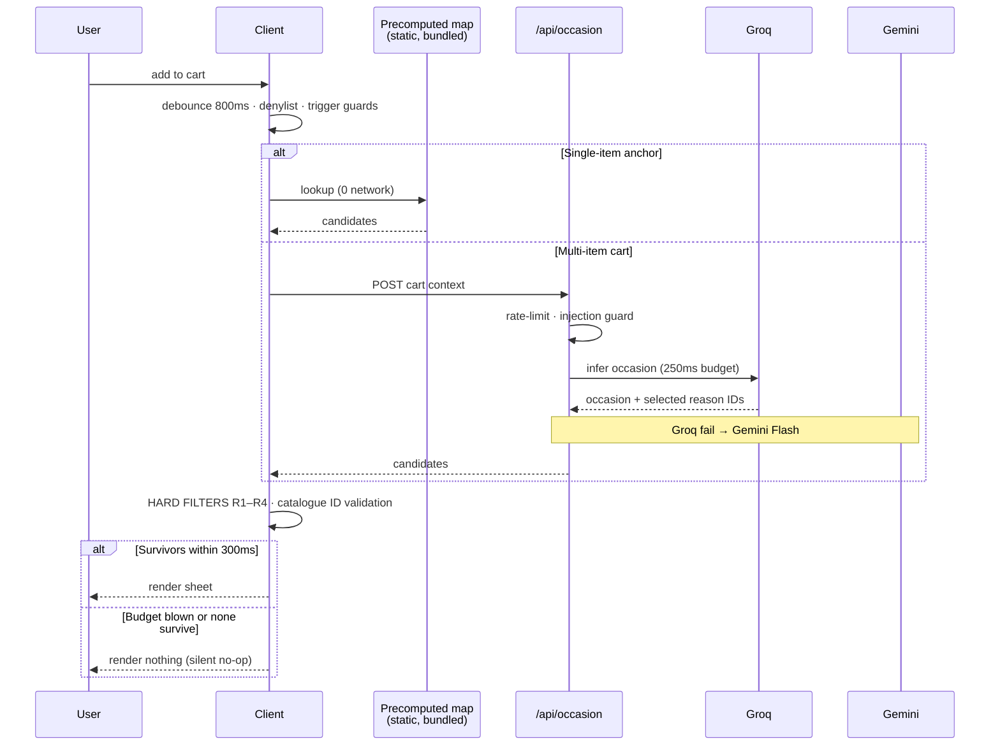

# Technical Architecture — Blinkit Category Expansion

**Status:** Draft v1
**Upstream:** [`context.md`](context.md) — brief, constraints, goal · [`docs/01-problem-statement.md`](docs/01-problem-statement.md) — full analysis
**Scope:** Part 1 (AI Discovery Engine) and Part 4 (AI-Native MVP), plus the data contract that joins them

> **Provisionality.** Per `context.md` §8, claims are labelled. Sections marked **[LOCKED]** are decided and will not change. Sections marked **[PROVISIONAL]** depend on findings from Part 2/3 and will be revised once primary research lands. The *technical* architecture is locked; the *product surface* of the MVP is provisional, because designing it before the interviews would violate standing principle #2.

---

## 1. Architectural thesis

Two systems, one data contract.

| | **Part 1 — Discovery Engine** | **Part 4 — MVP** |
|---|---|---|
| **Nature** | Offline batch pipeline | Online interactive product |
| **Optimised for** | Rigour, reproducibility, auditability | Latency |
| **Runs** | Locally / CI, on demand | Per user request, in production |
| **Latency tolerance** | Minutes to hours | **p95 < 3s to first token** |
| **Output** | Versioned evidence artifacts | A decision the user can act on |

These have irreconcilable requirements, so they are **separate systems** — not one service pretending to do both. Trying to run scraping and clustering inside a serverless function would fail on timeouts, cost, and reproducibility.

They are joined by a single **versioned artifact contract** (§5): the engine writes immutable JSON to `data/artifacts/<run_id>/`, and the Next.js app consumes it at build time. The engine never runs in production; the app never scrapes.



---

## 2. Technology stack **[LOCKED]**

| Layer | Choice | Why |
|---|---|---|
| **Engine language** | Python 3.12 | Ecosystem for scraping, embeddings, clustering. Already installed. |
| **App framework** | Next.js 15 (App Router) + TypeScript | First-class on Vercel; server routes keep API keys server-side; streaming built in. |
| **Hosting** | Vercel | Per `context.md` §6. |
| **Fast inference** | **Groq** | Sub-second time-to-first-token. This is not a preference — it is the only way to honour the "decidable in under a minute" constraint from `context.md` §4. |
| **Reasoning + embeddings** | **Google Gemini** | Long context for corpus-scale synthesis; native embedding model; strong multilingual (Hinglish) handling. |
| **Styling** | Tailwind CSS | Speed of build; no runtime cost. |
| **Vector storage** | Precomputed embeddings as static JSON | Catalogue is small (hundreds of SKUs). An external vector DB adds auth, cost, latency and a failure mode for zero benefit at this scale. |
| **State** | Stateless + `sessionStorage` | No accounts, no PII — directly serves the anonymity constraint. |

### 2.1 Model routing strategy **[LOCKED]**

Two providers, each used where its physics wins:

| Task | Provider | Model class | Rationale |
|---|---|---|---|
| Real-time user-facing reasoning | **Groq** | Large instruct model (e.g. Llama 3.3 70B class) | TTFT is the entire product constraint |
| High-volume cheap classification (relevance, language, sentiment) | **Groq** | Small/fast model | Thousands of docs; cost and throughput dominate |
| Theme labelling — candidate A | **Groq** | Large instruct | Independent generator for cross-model adjudication (§4.6) |
| Theme labelling — candidate B | **Gemini** | Flash | Second independent generator — *must be a different model family or the agreement metric is meaningless* |
| Corpus-scale insight synthesis | **Gemini** | Pro | Long context; reasoning depth; runs offline so latency is irrelevant |
| Embeddings | **Local TF-IDF** | TF-IDF + SVD | Local TF-IDF used to bypass PyTorch Windows bugs and Gemini API limits (deviation from BGE-Small P0-8b). |
| Translation (Hinglish/Hindi → EN) | **Gemini** | Flash | Strong Indic-language handling |

> **Model IDs are deliberately not hardcoded in this document.** They change faster than docs do. All IDs live in one config module (`engine/config.py`, `lib/models.ts`) and must be verified against current provider docs at build time.

---

## 3. Part 1 — Discovery Engine architecture



### 3.1 Stage 1 — Ingestion

| Source | Method | Notes |
|---|---|---|
| **Play Store** | `google-play-scraper` | Highest volume for Indian users. Filter to Blinkit package, sort by newest + most relevant to avoid recency-only bias. |
| **App Store** | iTunes RSS reviews endpoint | Lower volume in India; skews to a different demographic — **keep separate as a segment signal, do not merge blindly.** |
| **Reddit** | Official API (read-only) | `r/india`, `r/bangalore`, `r/mumbai`, `r/delhi`, `r/IndianFood`, `r/PetsIndia`, `r/IndianSkincareAddicts`, `r/personalfinanceindia`. Comments matter more than posts — that's where reasoning lives. |
| **Forums / Social** | Curated export | No reliable free API. Manually collected, provenance recorded per document. **Labelled as lower-tier evidence in the source-diversity score (§4.5).** |
| **Competitor corpus** | Same methods, Zepto/Instamart | Not for benchmarking — to separate *category-expansion* complaints from *quick-commerce-generic* complaints. Without this control, we would mistake industry noise for Blinkit-specific insight. |

**Ethics and compliance:** public data only; respect `robots.txt` and rate limits; no authentication-walled content; no attempt to re-identify individuals. Usernames are hashed at ingest and never persisted in cleartext. This is both an ethical baseline and an extension of the anonymity constraint.

### 3.2 Stages 2–5 — Conditioning

**Normalise** — every source collapses into one schema (§5.1). Divergent shapes are the main source of downstream bugs.

**Dedup** — MinHash/LSH near-duplicate detection. Critical for integrity: bot reviews, copy-pasted complaints and cross-posted Reddit content will otherwise **inflate a theme's apparent frequency**, and frequency is what we rank insights by. Duplicates are collapsed, not deleted, and the collapse count is retained.

**Language** — Indian app reviews are heavily Hinglish, Devanagari, and code-mixed. English-only NLP would silently discard a large and probably non-random slice of the corpus. Detect → translate to English for embedding → **retain the original text verbatim** for quoting (§4.3 verifies quotes against the original, not the translation).

**Relevance** — a fast Groq classifier tags each document (`category-discovery`, `delivery`, `pricing`, `app-bug`, `support`, `other`). Documents are **tagged, never silently dropped** — off-topic volume is itself a finding, and a pipeline that quietly deletes 80% of its input is not auditable.

### 3.3 Stages 6–7 — Bottom-up theme discovery

This stage is where the brief's requirement — *"how themes are identified"* — is actually satisfied.

**The constraint that matters:** themes must emerge from the data, not from a prompt that asks a model to sort reviews into buckets we wrote in advance. If I hand an LLM the categories from `docs/01-problem-statement.md` and ask it to classify, I have proven nothing except that the model can follow instructions — and I will have laundered my own hypothesis into "evidence."

**Therefore:**

1. Embed every document into a shared vector space.
2. Reduce dimensionality (UMAP) — cosine distance degrades in high dimensions.
3. Cluster with **HDBSCAN**, which is chosen specifically because:
   - it does **not** require choosing *k* in advance (no imposed structure), and
   - it has an explicit **noise class**, so documents that don't fit are labelled noise rather than forced into a cluster.
4. Only *after* clusters exist does an LLM see them — and only to *name* what is already there.

Cluster count, size distribution and noise proportion are all recorded as artifacts.

### 3.4 Stage 8 — Theme labelling, twice, independently

Each cluster's representative documents (medoid + sampled members) go to **two different model families** — Groq and Gemini — independently, with no knowledge of each other's output.

Each returns: a label, a one-line definition, and boundary conditions (what is *excluded*).

Agreement between the two becomes the theme-stability signal in §4.6. Running the same prompt twice against the same model would measure temperature noise, not reliability — the two generators must be genuinely different models for the metric to mean anything.

### 3.5 Stage 9 — Insight synthesis

Themes are descriptive (*"users mention not knowing which product to pick"*). Insights are explanatory and actionable (*"evaluation cost, not awareness, blocks first purchase"*). Gemini Pro performs this step offline over the full theme set.

**Hard output contract — enforced by schema validation, not by prompt politeness:**

- Every insight **must** cite ≥ 3 distinct `document_id`s
- Every insight **must** carry ≥ 1 verbatim quote per cited document
- Every insight **must** state its confidence and what would falsify it
- Any insight failing these is **rejected at parse time**, not filed with a caveat

An insight with no traceable evidence is not a weak insight. It is a fabrication, and it is discarded.

### 3.6 Mapping to the eight required questions

The brief's eight questions (`context.md` §5) are answered **after** clustering, by querying the theme/insight artifacts — never by asking a model the question directly against raw text. Each answer carries its supporting theme IDs and evidence, so every answer is traceable back to source documents.

| Brief question | Primary artifact |
|---|---|
| 1. Why repeat the same categories? | Themes tagged `habit`, `routine` + insight synthesis |
| 2. What prevents exploration? | Themes tagged `barrier` — ranked by frequency × source diversity |
| 3. How do users discover today? | Themes tagged `discovery-channel` |
| 4. Role of habits? | Cross-cut: habit-tagged themes × segment |
| 5. Information needed before trying? | Themes tagged `information-gap` — **directly tests the evaluation-cost hypothesis** |
| 6. Recurring frustrations? | Frequency ranking across all `frustration` themes |
| 7. Which segments experiment? | Segment inference layer × theme participation |
| 8. Consistent unmet needs? | Insights ranked by frequency × diversity × persistence |

---

## 4. Validation architecture *(the differentiator)*

Per `context.md` §5, insight-quality validation is where the marks are and where most submissions are thin. It is therefore a **first-class subsystem with its own artifacts**, not a paragraph at the end of a notebook.

Seven independent checks. Each emits a machine-readable score; the run produces a **validation report** that ships alongside the insights.

### 4.1 Groundedness — does the evidence exist?
Every quote an LLM emits is **string-matched against the original source document**. Not fuzzy-matched, not judged by another model — matched. A quote that does not appear verbatim in the corpus is a hallucination, and the insight carrying it is quarantined.
→ *Metric: % of quotes verified. **Target: 100%.** Anything below is a pipeline defect, not a tolerance.*

### 4.2 Coverage — how much of the corpus is explained?
HDBSCAN's noise class gives this for free. If 60% of documents are noise, the themes describe a minority of what users said.
→ *Metric: % of relevant documents assigned to a named theme.*

### 4.3 Source diversity — is this real or an artifact of one community?
An insight supported by 40 documents that are all Reddit comments from one subreddit is one community's opinion. The same insight across Play Store, App Store, Reddit and forums is a pattern.
→ *Metric: per-insight Shannon entropy across sources. Low-entropy insights are explicitly flagged as **single-source, treat with caution** — surfaced in the UI, not hidden.*

### 4.4 Stability — would we get the same themes on a different sample?
Bootstrap: re-run clustering on N random 80% subsamples with different seeds. Themes that survive resampling are robust; themes that appear once are artifacts of a particular draw.
→ *Metric: theme persistence rate across runs.*

### 4.5 Cross-model agreement — inter-rater reliability, mechanised
The classical qualitative-research check is two human coders independently coding the same data, scored with Cohen's κ. Here, Groq and Gemini are the two coders (§3.4). Where they converge on a cluster's meaning, confidence is high. Where they diverge, the cluster is genuinely ambiguous and is **escalated for manual review** rather than silently resolved.
→ *Metric: κ-analogue on theme assignment.*

### 4.6 Human spot-check — the honesty anchor
A stratified random sample (~50 documents) is coded by hand, blind to the pipeline's output, then compared. Every automated metric above can be satisfied by a system that is *consistently* wrong. This is the only check that catches that.
→ *Metric: human–pipeline agreement. Documented honestly including disagreements.*

### 4.7 Adversarial / negative control — does it invent things on demand?
The synthesiser is asked to find evidence for a plausible-sounding theme **known to be absent** from the corpus (e.g. *"users want to schedule deliveries three weeks in advance"*). A correctly-built system returns insufficient evidence. A sycophantic one manufactures support.
→ *Metric: pass/fail. **A failure here invalidates the entire run.***

### 4.8 Confounder control
The competitor corpus (§3.1) separates Blinkit-specific findings from quick-commerce-generic ones. A complaint that appears identically in Zepto and Instamart discussions is an industry condition, not a Blinkit insight.

> **Design principle for this subsystem.** The validation layer must be capable of *failing the run*. A validation layer that always passes is decoration. §4.1 and §4.7 are hard gates.

---

## 5. Data contract **[LOCKED]**

The interface between the two systems. Everything is immutable and versioned by `run_id`.

```
data/artifacts/<run_id>/
├── manifest.json          run metadata, config hash, model IDs, timestamps, corpus counts
├── documents.jsonl        normalised corpus (post-dedup)
├── clusters.json          cluster assignments + geometry
├── themes.json            labelled themes + both models' candidate labels
├── insights.json          insights + citations + confidence + falsifiers
├── validation.json        all seven check results
└── qa/
    ├── human_sample.json  stratified sample + hand codes
    └── failures.json      quarantined insights + reason
```

### 5.1 Core schemas

```typescript
type Document = {
  document_id: string;          // stable hash — the primary key for all traceability
  source: 'play_store' | 'app_store' | 'reddit' | 'forum' | 'social';
  source_detail: string;        // subreddit, forum name — needed for diversity scoring
  brand: 'blinkit' | 'zepto' | 'instamart' | 'other';  // confounder control
  text_original: string;        // NEVER overwritten — quotes are verified against this
  text_english: string | null;  // translation, if source wasn't English
  language: string;
  rating: number | null;
  created_at: string | null;
  author_hash: string;          // hashed at ingest. Cleartext never persisted.
  relevance_tags: string[];
  duplicate_of: string | null;
  duplicate_count: number;      // collapsed near-duplicates — guards frequency inflation
};

type Theme = {
  theme_id: string;
  label: string;
  definition: string;
  excludes: string[];                       // boundary conditions
  candidate_labels: { groq: string; gemini: string };  // both coders, preserved
  agreement_score: number;
  document_ids: string[];
  size: number;
  persistence: number;                      // §4.4 bootstrap survival rate
  source_entropy: number;                   // §4.3
  tags: string[];
};

type Insight = {
  insight_id: string;
  statement: string;
  reasoning: string;
  theme_ids: string[];
  evidence: Array<{
    document_id: string;
    quote: string;              // must string-match Document.text_original
    verified: boolean;          // §4.1 — false ⇒ quarantined
  }>;
  confidence: 'high' | 'medium' | 'low';
  falsifier: string;            // what observation would disprove this
  caveats: string[];
  answers_brief_question: number[];   // 1–8, per §3.6
};
```

**Why `text_original` is never mutated:** §4.1 verifies quotes against source text. If translation or cleaning overwrote the original, groundedness could not be checked and the strongest validation guarantee would collapse.

---

## 6. Part 4 — MVP architecture

### 6.1 Product surface — **the Occasion Engine** **[LOCKED, research-refined]**

> **Decided.** Full spec: [`docs/06-mvp-concept.md`](docs/06-mvp-concept.md).
>
> On add-to-cart, infer the **occasion** behind the item and surface 1–2 items from a **different L1 category** that the occasion implies — each carrying the reason it matters. Presented as a **non-blocking inline sheet**, never a modal.
>
> **Sequencing note.** This was locked *before* Part 2, superseding the original position below. That is a deliberate trade of narrative purity for calendar time. The interviews now test *this mechanic* — trigger timing, whether reasons change willingness, which occasions feel real — rather than choosing the concept. `docs/06-mvp-concept.md` §8 records what research finding would invalidate it. The submission states this plainly rather than implying the concept emerged from the research.

What the surface must satisfy (`context.md` §4):

> Make a first-time category purchase **decidable in under a minute, inside the session the user was already having** — without regressing time-to-order for the core basket.

**Architecturally**, that constraint implies a system that:
1. **Triggers off a committed action** (add-to-cart), not off a query the user must compose — because `docs/01-problem-statement.md` §3.4 establishes that users can only search what they can already name, so any text-entry surface excludes the exact first-time buyer we are targeting;
2. Retrieves candidate SKUs from a **different L1** than the anchor;
3. Returns **1–2 items, not a list** — presenting ten options recreates the evaluation cost we are trying to remove;
4. Carries a **reason** per item, drawn from a pre-validated fact set (`edge.md` EC-M4);
5. Renders **fast enough to be non-disruptive, or not at all**;
6. Ends in **one-tap add-to-cart**, preserving the speed franchise.

### 6.2 Request path



**Note the shape.** The common path (single-item add) makes **no network call at all** — it is a static lookup against a bundled map. Live inference exists only for multi-item cart context, where the precomputed map cannot reach. This is what makes the 300ms budget achievable.

### 6.3 Latency budget **[LOCKED]**

The product constraint is a *latency* constraint, so it is specified as an engineering budget, not an aspiration.

| Path | Stage | p50 | p95 |
|---|---|---|---|
| **Precomputed** *(common)* | Map lookup + filters + render | 15ms | 40ms |
| **Live** *(multi-item)* | Route + guards | 20ms | 50ms |
| | Groq occasion inference | 180ms | 400ms |
| | Filters + catalogue validation | 5ms | 15ms |
| | **Total to rendered sheet** | **~205ms** | **< 465ms** |
| **Hard ceiling (R8)** | Abandon and render nothing beyond | — | **300ms** |

**No streaming.** Streaming exists to make long responses tolerable. This surface has no long response — it renders complete or not at all. A partially-streamed suggestion sheet would be worse than none.

**Guard:** any path exceeding R8's 300ms is **abandoned, not delayed**. Per `edge.md` EC-L1, a loading skeleton on a non-blocking sheet reads as broken rather than loading. Late is worse than absent.

### 6.4 Degradation ladder **[LOCKED]**

A live demo that breaks during evaluation scores zero regardless of design quality.

| Tier | Condition | Behaviour |
|---|---|---|
| 1 | Normal | Groq reasoning, streamed |
| 2 | Groq unavailable / rate-limited | Gemini Flash, streamed. Silent to user. |
| 3 | Both LLMs unavailable | Deterministic retrieval + templated reasoning. Degraded but functional and honest. |
| 4 | Total failure | Explicit error state. **Never a blank screen or a spinner that hangs.** |

Tier 3 matters most: it means the core retrieval logic is real code, not a prompt. The system demonstrably *works* rather than merely *calls an API*.

### 6.5 Catalogue data **[PROVISIONAL]**

No access to Blinkit's real catalogue. A synthetic catalogue (~200–400 SKUs across L1 categories) is generated with realistic attributes — brand, pack size, price, and the fit attributes that matter for first-purchase decisions (skin type, pet weight/age, baby stage).

**Labelled clearly as synthetic in the UI.** Passing fabricated catalogue data off as real Blinkit data would be dishonest and would undermine everything the validation subsystem is built to demonstrate.

Embeddings are precomputed at build time and shipped as a static artifact — zero runtime embedding cost for the catalogue, and no external vector service to fail.

---

## 7. Repository layout **[LOCKED]**

```
/
├── context.md
├── architecture.md
├── .gitignore
├── docs/
│   ├── 01-problem-statement.md
│   ├── 02-discovery-engine-report.md     Part 1 writeup
│   ├── 03-research-kit.md                Part 2 instruments
│   ├── 04-research-synthesis.md          Part 2 findings
│   └── 05-problem-definition.md          Part 3 + reconciliation
│
├── engine/                               Part 1 — Python
│   ├── config.py                         all model IDs live here
│   ├── pipeline.py
│   ├── ingest/  normalize/  embed/
│   ├── cluster/  synthesize/
│   ├── validate/                         the seven checks
│   └── tests/
│
├── data/
│   ├── raw/                              gitignored — large, regenerable
│   └── artifacts/<run_id>/               committed — the evidence
│
├── app/                                  Part 4 — Next.js App Router
│   ├── page.tsx                          MVP surface
│   ├── insights/page.tsx                 Insights Explorer (static, from artifacts)
│   └── api/decide/route.ts
├── lib/
│   ├── models.ts                         model IDs + routing
│   ├── retrieval.ts                      deterministic — works without LLM (tier 3)
│   └── guards.ts                          validation, rate limit, injection
└── data/catalogue/                       synthetic SKUs + precomputed vectors
```

**Vercel builds the Next.js app at repo root.** `engine/` is Python and is excluded via `.vercelignore` so it never enters the build. The two systems share a repo but not a runtime.

**Why artifacts are committed:** they are the evidence. An evaluator must be able to trace any insight to its source documents without re-running a scrape that would return different data. Raw scrapes are gitignored; artifacts are the record.

---

## 8. Security, privacy, and anonymity

Anonymity (`context.md` §6) is an architectural requirement, not a review step.

| Concern | Control |
|---|---|
| **API keys** | Server-side only. Never `NEXT_PUBLIC_*`. Set in Vercel dashboard; never committed. `.env*` gitignored. |
| **Key exposure via client** | All LLM calls go through route handlers. The browser never sees a provider endpoint. |
| **Prompt injection** | User free-text is untrusted input. Delimited, length-capped, never concatenated into system instructions. Model output is rendered as text, never executed. |
| **Abuse / cost** | Per-IP rate limiting on `/api/decide`; max token caps per request; hard monthly spend alerts. |
| **PII** | None collected. No accounts, no email, no analytics identifiers. |
| **Corpus authors** | Usernames hashed at ingest; cleartext never persisted (§3.1). |
| **Author identity** | Repo-local `git config user.name/user.email` set to neutral values before first commit; `.claude/settings.local.json` gitignored (contains the local home path); Vercel project named neutrally so the subdomain carries no identifier; no author byline in page metadata, `<title>`, or footer. |

---

## 9. Architecture decision record

| # | Decision | Rationale | Rejected alternative |
|---|---|---|---|
| **AD-1** | Offline engine, online app — separate systems | Irreconcilable latency and reproducibility requirements | One service doing both — fails serverless timeouts, unreproducible |
| **AD-2** | HDBSCAN over LLM classification for theming | Themes must emerge bottom-up; LLM-into-predefined-buckets would launder our own hypothesis into "evidence" | Prompting a model to sort reviews into the categories we already wrote |
| **AD-3** | Two model families as independent coders | Cross-model agreement is a real reliability signal; same-model-twice measures temperature noise | Single model, self-consistency sampling |
| **AD-4** | Groq for online, Gemini for offline | Groq's TTFT *is* the product constraint; Gemini's context and embeddings suit corpus work | One provider for everything — sacrifices either latency or corpus capability |
| **AD-5** | Quotes verified by string match, not model judgement | An LLM checking another LLM's citations shares the failure mode. String matching cannot be fooled. | LLM-as-judge for groundedness |
| **AD-6** | Static precomputed vectors, no vector DB | Hundreds of SKUs. A DB adds auth, cost, latency, and a failure mode for zero benefit at this scale. | Pinecone / pgvector |
| **AD-7** | Four-tier degradation ladder | A demo that breaks during evaluation scores zero. Tier 3 also proves the retrieval logic is real code. | Fail loudly on API error |
| **AD-8** | Artifacts committed to the repo | Traceability. Evaluators must verify insights without re-scraping. | Regenerate on demand |
| **AD-9** | ~~MVP surface left provisional~~ **Superseded — surface locked as the Occasion Engine** | Calendar time. Concept locked pre-research as an explicit, documented trade; interviews now test the mechanic rather than select the concept. Invalidation conditions recorded in `docs/06-mvp-concept.md` §8. | Waiting for Part 2 — safer narrative, unaffordable schedule |
| **AD-11** | Occasion headline + per-item reason, not a product tile | Occasion earns attention; the reason makes the item decidable. A tile alone collapses into the carousel that `docs/01-problem-statement.md` §7 rules out. | Conventional recommendation card |
| **AD-12** | Non-blocking inline sheet, never a modal | A modal taxes time-to-order for the majority who dismiss it, violating `context.md` §8 #4. Speed is the franchise. | Modal popup |
| **AD-13** | Hard rules R1–R8 enforced in code, not prompts | Models drift — an LLM asked for a cross-category suggestion will return same-category ones. Filters must be deterministic. | Prompt-only constraints |
| **AD-14** | Hybrid precompute + live inference | R8's 300ms budget is unmeetable by a cold LLM call, and a skeleton on a non-blocking sheet reads as broken. Precompute covers the common case; live handles multi-item carts. | Fully live per add |
| **AD-10** | Competitor corpus as a control | Separates Blinkit-specific insight from quick-commerce-generic noise | Blinkit-only corpus |

---

## 10. Known risks

| Risk | Impact | Mitigation |
|---|---|---|
| Scraped volume too low for stable clustering | Themes unstable; §4.4 fails | Widen date range and subreddit set; if still thin, **report the limitation rather than lowering the persistence threshold** |
| Corpus is dominated by delivery/pricing complaints, with little on category discovery | The engine can't answer the brief's core questions | This is itself a finding — absence of discovery discourse supports the "users don't think of Blinkit that way" thesis (Loop E). Report it as evidence, not failure. |
| Hinglish translation loses nuance | Misclassified sentiment | Retain originals; include code-mixed docs in the §4.6 human sample specifically |
| Groq or Gemini rate limits during evaluation | Live demo degrades | Degradation ladder §6.4; artifacts are static so the Insights Explorer never depends on a live API |
| Vercel function timeout on slow LLM response | Request fails | Streaming responses; explicit `maxDuration`; hard token caps |
| Synthetic catalogue reads as unconvincing | Weakens the MVP demo | Realistic attributes, clearly labelled as synthetic — honesty is more defensible than a convincing fake |
| Confirmation bias — engine "finds" the evaluation-cost thesis because we wrote it first | **Invalidates Part 1 entirely** | AD-2 (bottom-up clustering), §4.7 (negative control), §4.6 (blind human coding). This is the single most important risk in the project. |

---

## 11. Build sequence

| Phase | Deliverable | Depends on |
|---|---|---|
| 0 | Repo scaffold, config, `.gitignore`, neutral git identity | — |
| 1 | Ingestion + normalisation → `documents.jsonl` | Phase 0 |
| 2 | Embedding + clustering → `clusters.json`, `themes.json` | Phase 1 |
| 3 | Synthesis → `insights.json` | Phase 2 |
| 4 | **Validation subsystem** → `validation.json` | Phase 3 |
| 5 | Insights Explorer (static, traceable) | Phase 4 |
| 6 | Research kit *(can start any time — recruiting is the long pole)* | — |
| 7 | Synthesis + reconciliation | Phase 5 + interviews |
| 8 | MVP surface design | Phase 7 |
| 9 | MVP build + Vercel deploy | Phase 8 |

**Phase 6 is calendar-blocking and should start first.** Recruiting 5–6 interviewees takes days; the engine does not.

---

> **Maintenance.** `context.md` is upstream of this file. If the problem framing changes, update `context.md` and `docs/01-problem-statement.md` first, then revise **[PROVISIONAL]** sections here. **[LOCKED]** sections should only change with a new ADR row explaining why.
