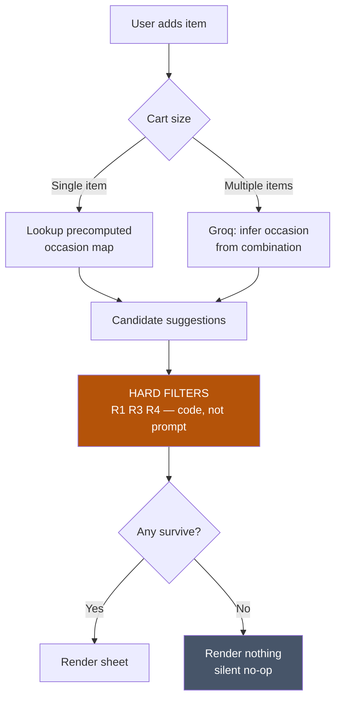

# MVP Concept — The Occasion Engine

**Status:** Spec v1 — concept locked, copy and adjacency set to be refined by Part 2 research
**Upstream:** [`context.md`](../context.md) · [`docs/01-problem-statement.md`](01-problem-statement.md) · [`architecture.md`](../architecture.md)
**Part:** 4 — AI-Native MVP

---

## 1. The concept in one line

> When a user adds an item to their cart, infer the **occasion** behind it, and surface one or two items from a **different L1 category** that the occasion implies — each with the reason it matters.

Not a recommendation. A completion.

---

## 2. Why this shape

`docs/01-problem-statement.md` §7 argues that a Discover tab and a recommendation carousel both fail. This concept is neither, and the distinction is load-bearing.

| | Discover tab | Recommendation carousel | **Occasion Engine** |
|---|---|---|---|
| **Trigger** | Ambient — waits to be tapped | Ambient — sits on a page | **Contextual — fires off a committed action** |
| **Signal** | None | Click co-occurrence | **Semantic: what is this product *for*?** |
| **User is told** | "Here are categories" | "You might also like" | **"Here's what you'll also need, and why"** |
| **Solves trigger?** | Weakly | Yes | Yes |
| **Solves evaluation cost?** | No | No | **Yes — the reason is the product** |
| **Popularity bias (Loop A)?** | n/a | Severe | **Immune — no engagement signal in the loop** |

### 2.1 The two moves that make it work

**Move 1 — Contextual, not ambient.**
A mission-mode user never taps a Discover tab. But they *just* tapped ADD. The intent is live, the commitment is made, and extending it costs no mode-switch. We are not asking them to browse; we are completing a decision already taken.

**Move 2 — The reason is the product.**

> ❌ *"You might also like: pet-safe floor cleaner"*
> ✅ *"Regular phenyl is toxic to dogs. This one's pet-safe."*

The second is not a recommendation — it is **information the user did not have**, where the product happens to be the resolution. This is the entire thesis of `docs/01-problem-statement.md` §3.5 executed in one line of copy: the first-time buyer's blocker is that they cannot *decide*, and a compelling reason is the cheapest possible decision aid.

Critically, this is why the feature must be **AI-native rather than statistical**. Collaborative filtering cannot produce "phenyl is toxic to dogs" — that requires reasoning about what a product is *for*. No amount of click data yields it. Which is also why Loop A (popularity bias) does not apply: there is no engagement signal in the loop to reinforce.

---

## 3. The surface

### 3.1 Trigger **[LOCKED]**

Fires on **add-to-cart**, not on product-tap.
Tapping a product is browsing. Adding it is commitment. Firing on tap would interrupt evaluation; firing on add extends a completed decision.

### 3.2 Presentation **[LOCKED — revised, see `docs/08-design-integration.md` §4]**

> **Desktop:** a persistent **320px right rail**. **Mobile:** a non-blocking inline sheet. The rail is the built surface; the sheet description below states the principle both must satisfy.

A rail is strictly better for the non-blocking requirement on desktop — it sits beside the content and cannot overlay the cart button or interrupt the tap path. It is **always occupied** (persona panel when idle), so a suggestion arriving causes no layout shift.

The original mobile framing, which still governs the principle: a **non-blocking inline sheet** that slides in beneath the add-to-cart confirmation.

**It must never be a modal.** `context.md` §8 principle #4: speed is the franchise, and any regression in time-to-order is a net loss regardless of what it does to CER. A modal intercepts the tap path of every user, including the ~90% who will dismiss it. An inline sheet is visible to everyone and costs nothing to anyone who ignores it.

- Dismissed by **continuing** — no explicit close action required
- Auto-collapses after N seconds of no interaction
- Never intercepts a tap
- Never blocks checkout

### 3.3 Anatomy

```
┌──────────────────────────────────────────┐
│  ✓ Pedigree Adult 3kg added              │   ← existing confirmation
├──────────────────────────────────────────┤
│                                          │
│  Restocking for the dog?                 │   ← OCCASION (the headline)
│                                          │
│  🧴  Pet-safe floor cleaner       ₹185   │
│      Regular phenyl is toxic to dogs     │   ← REASON (per item)
│                                    [ADD] │
│                                          │
│  🧻  Lint roller                   ₹99   │
│      For the sofa                        │
│                                    [ADD] │
│                                          │
└──────────────────────────────────────────┘
```

**Occasion is the headline. Reason is the item line.** The occasion earns attention; the reason makes the item decidable. Dropping either collapses the feature — occasion alone is a themed carousel, reason alone is a utility prompt with no hook.

---

## 4. Hard rules — enforced in code, not in prompts

An LLM will drift. These are filters applied to model output, not instructions given to it.

| # | Rule | Why |
|---|---|---|
| **R1** | Suggested item **must** be a different L1 from the trigger item | The entire metric (CER) is defined at L1. Same-L1 suggestions score zero against the goal. |
| **R2** | **Maximum 2** suggestions. Never a scrollable rail. | A list recreates the evaluation cost we are removing. Three options is a decision; ten is a chore. |
| **R3** | Suppress if the user has **already purchased** that L1 | By definition it is not a *new* category, so it cannot move CER. |
| **R4** | Suppress if suggested SKU is **out of stock** | Loop D: a disappointing first exploration manufactures a durable "Blinkit isn't for that" belief. Worse than showing nothing. |
| **R5** | Frequency cap — at most **once per session** | Firing on every add trains users to ignore it. Habituation kills the surface. |
| **R6** | Reason must be **factually defensible** — no invented claims | A wrong safety claim ("toxic to dogs") is a trust and liability failure. Reasons are validated against a curated fact set, not free-generated. |
| **R7** | **No price-led framing.** Never lead with a discount. | `docs/01-problem-statement.md` §7: coupon-led trial moves CER and fails C60. We want the category, not the transaction. |
| **R8** | Sheet must render in **< 300ms** or not at all | Late is worse than absent — it would appear after the user has moved on. |

> **R6 is the one most likely to be cut under time pressure and must not be.** The feature's credibility rests entirely on its reasons being true. One confidently wrong claim discredits every other suggestion the system makes.

---

## 5. The occasion model

### 5.1 Data structure

```typescript
type Occasion = {
  occasion_id: string;
  headline: string;              // "Restocking for the dog?" — user-facing
  anchor_skus: string[];         // single-SKU triggers
  anchor_combos: string[][];     // multi-item triggers (live inference)
  suggestions: Array<{
    sku_id: string;
    l1: string;                  // must differ from anchor L1 (R1)
    reason: string;              // ≤ 60 chars, factually grounded (R6)
    fact_source: string;         // provenance for the claim
  }>;
  confidence: number;
  seasonal: boolean;             // Holi, Diwali, monsoon — time-gated
};
```

### 5.2 Worked examples

| Anchor (L1) | Occasion | Suggestion (different L1) | Reason |
|---|---|---|---|
| Dog food *(Pet Care)* | Restocking for the dog? | Pet-safe floor cleaner *(Cleaning)* | Regular phenyl is toxic to dogs |
| Holi colours *(Seasonal)* | Holi prep? | Coconut oil *(Personal Care)* | Apply before — colour washes off easier |
| Paneer + cream *(Dairy)* | Cooking something rich tonight? | Kitchen foil *(Home & Office)* | For storing leftovers |
| Birthday cake *(Bakery)* | Celebrating at home? | Candles + paper plates *(Home & Office)* | Everything else for the table |
| Protein powder *(Health)* | Back to the gym? | Shaker bottle *(Home & Office)* | Mixes without lumps |
| Paracetamol *(Pharma)* | Someone unwell? | Electrolyte + tissues *(Beverages / Home)* | Fever needs fluids more than food |
| Chips + soft drinks *(Munchies)* | People coming over? | Disposable glasses *(Home & Office)* | Fewer dishes after |
| Baby cereal *(Baby Care)* | Starting solids? | Stain remover *(Cleaning)* | First-solids month is messy |

**The strongest rows are the ones that teach something** — pet-safe cleaner, coconut oil before Holi, electrolyte over food. These convert because they resolve genuine uncertainty. The weakest are the merely-convenient ones (foil, glasses), which read as ordinary upsell. **Adjacency quality is the product**, and Part 2 research should be used to find more of the former.

---

## 6. Compute architecture — hybrid **[LOCKED]**



**Offline (build time):** Gemini generates the occasion map across the synthetic catalogue — every SKU mapped to 1–3 occasions with cross-L1 suggestions and grounded reasons. Human-reviewed for R6, cached as a static artifact. Zero runtime cost, instant lookup, satisfies R8.

**Online (runtime):** Groq infers occasion from **multi-item cart combinations**, which is where the precomputed map cannot reach — `paneer + cream + naan` is a different occasion from `paneer` alone. Low latency, and this is the visibly-AI path in the live demo.

**Why hybrid rather than fully live:** R8 gives a 300ms budget. A cold LLM call cannot reliably meet it, and a skeleton loader on a non-blocking sheet looks broken rather than loading. Precompute covers the common case instantly; live reasoning handles the case that genuinely needs it.

**Degradation:** per `architecture.md` §6.4 — Groq fails → Gemini Flash; both fail → precomputed map only; map miss → **render nothing**. A silent no-op is a perfectly good outcome for this surface. It should never show an error.

---

## 7. Instrumentation

The feature must be measurable against the actual goal, not against its own engagement.

| Metric | Definition | Purpose |
|---|---|---|
| **Sheet impressions** | Rendered, not requested | Denominator |
| **Add rate** | Adds ÷ impressions | Surface effectiveness |
| **New-L1 add rate** | Adds where L1 is new *to that user* | **Direct CER contribution** |
| **C60** | Repurchase of that L1 within 60 days | `context.md` §3 — the honest metric |
| **Occasion precision** | Adds ÷ impressions, **by occasion** | Finds which adjacencies actually work; prune the rest |
| **Reason lift** | A/B: with reason vs product-only | **Directly tests the core thesis.** If lift is ~0, the evaluation-cost hypothesis is wrong. |

### Guard metrics — a win on CER that breaks any of these is a net loss

- **Time-to-checkout must not regress** — the franchise (`context.md` §8 #4)
- Core-basket conversion must hold
- Return/complaint rate on suggested items within tolerance (Loop D)
- Sheet dismissal rate — sustained high dismissal means we have built an ad

> **Reason lift is the most valuable experiment in the project.** It isolates the single claim the entire problem statement rests on. If showing the reason produces no lift over showing the product alone, then evaluation cost is not the binding constraint and the diagnosis needs revisiting.

---

## 8. What would invalidate this concept

Recorded now, per `context.md` §8 principle #2, since the concept was locked before the interviews.

| Finding from Part 2 | Consequence |
|---|---|
| Users don't know Blinkit stocks these categories at all | Problem is **awareness**, not evaluation. A contextual sheet is too small a surface; needs upstream merchandising. |
| Users see the suggestion, want it, but distrust the *brand* | Reason is insufficient. Needs social proof — ratings, "N bought this week". |
| Users say they'd research it later rather than add now | Trigger timing is wrong. Move to post-delivery, not add-to-cart. |
| Cart-stage additions are dominated by price sensitivity | R7 (no price-led framing) is wrong and the economics of the feature change. |
| Users find the sheet intrusive even non-blocking | Frequency cap must tighten, or the trigger moves entirely. |

**Research posture:** the interviews test *this specific mechanic* — trigger timing, whether reasons change willingness, which occasions feel real. They are not being used to choose the concept, and the submission should say so plainly rather than implying the concept emerged from the research.

---

## 9. Build plan

| # | Deliverable |
|---|---|
| 1 | Synthetic catalogue — 200–400 SKUs across L1s, with stock state and fit attributes |
| 2 | Occasion map generation (Gemini, offline) + human review pass for R6 |
| 3 | `lib/occasion.ts` — hard filters R1–R5, deterministic and unit-tested |
| 4 | Live occasion inference route (Groq) for multi-item carts |
| 5 | Cart simulator UI — enough Blinkit-like surface to make the demo legible |
| 6 | The sheet component — non-blocking, dismiss-by-continue |
| 7 | Instrumentation + a visible metrics panel for evaluators |
| 8 | Reason-lift A/B toggle *(demonstrates §7's key experiment live)* |
| 9 | Vercel deploy |

**Item 7 matters for grading.** An evaluator cannot see CER move in a demo. A visible panel showing which adds were new-L1, and what the reason-lift toggle does to add rate, makes the product logic legible in a two-minute review.

---

> **Naming.** The feature has no fixed UI label by design — the headline *is* the occasion, so a permanent title ("Discover", "You may also like") would only add noise and re-frame it as a recommendation. Internal name: **Occasion Engine**.
