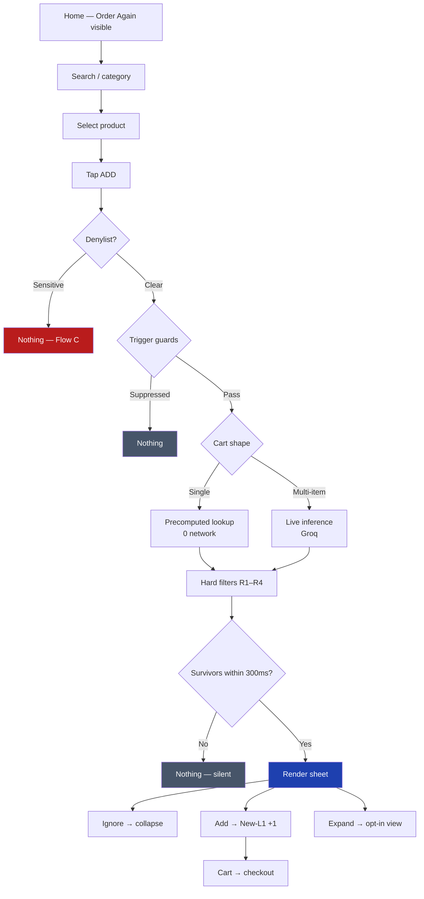

# Demo Journey — Occasion Engine

**Status:** v1
**Upstream:** [`docs/06-mvp-concept.md`](06-mvp-concept.md) · [`edge.md`](../edge.md) · [`implementation-plan.md`](../implementation-plan.md)
**Purpose:** The exact screen-by-screen path an evaluator walks. Defines what gets built in Phase 12 and what the demo narrative is.

> ⚠️ **Layout superseded.** The wireframes below are drawn mobile-first. The build is **desktop, 1280px**, using the Stitch design system, with the suggestion surface as a **320px right rail** rather than a bottom sheet. See [`docs/08-design-integration.md`](08-design-integration.md) §4 for the authoritative layout. **The flows, copy, persona, timings and evaluator script below are all unchanged and remain authoritative.**

---

## 1. Demo design principles

**The demo must show restraint, not just capability.** Any submission can show a feature firing. What distinguishes this one is showing the moments it *deliberately does nothing* — the sensitive-category block, the already-buys-this suppression. Those are the hardest parts to build and the easiest to overlook.

So the journey has **four flows**, in this order:

| Flow | Shows | Why it's in the demo |
|---|---|---|
| **A — Hero** | Precomputed path, single anchor, cross-L1 suggestion with a teaching reason | The core mechanic |
| **B — Live AI** | Multi-item cart → occasion inferred at runtime | Proves it's genuinely AI-native, not a lookup table |
| **C — Restraint** | Sensitive anchor → **nothing happens** | The denylist. The most important 10 seconds of the demo. |
| **D — Suppression** | Anchor whose adjacency the user already buys → nothing happens | R3. Shows the metric is understood, not just the feature. |

**Total runtime: under 3 minutes.**

---

## 2. The demo persona

Seeded, fixed, and visible to the evaluator. Per `edge.md` EC-D5, the feature suppresses entirely without purchase history — so the demo *needs* a history for anything to fire.

```
DEMO USER  ·  Segment A: high-frequency, low-breadth
────────────────────────────────────────────────────
Orders (last 90 days):        23
L1 categories ever purchased:  3
  • Staples & Atta
  • Dairy, Bread & Eggs
  • Munchies & Snacks

Never purchased:
  Home & Office · Cleaning Essentials · Personal Care
  Baby Care · Pet Care · Pharma
────────────────────────────────────────────────────
```

This persona **is** the problem statement made concrete: 23 orders, high trust, high frequency — and three categories. Exactly the user `docs/01-problem-statement.md` §6 targets.

> A small panel showing this sits on screen throughout, so the evaluator can see *why* a suggestion is new-category without being told.

---

## 3. Flow A — the hero journey

### Step 1 · Home

```
┌────────────────────────────────────────┐
│  ⚠ DEMO DATA — synthetic catalogue     │  ← EC-P5, always visible
├────────────────────────────────────────┤
│  Delivery in 8 minutes                 │
│  Home · Sector 52, Gurugram            │
├────────────────────────────────────────┤
│  🔍  Search for atta, milk, eggs...    │
├────────────────────────────────────────┤
│  ORDER AGAIN                           │
│  [Atta 5kg] [Milk 1L] [Bread] [Eggs]   │
├────────────────────────────────────────┤
│  Staples  Dairy  Snacks  Home  Clean…  │
└────────────────────────────────────────┘
```

**Deliberate:** "Order Again" sits at the top, exactly as in the real app. The demo opens by showing the anti-discovery mechanism from `docs/01-problem-statement.md` §3.2 in its natural habitat. The evaluator sees the problem before they see the solution.

### Step 2 · Product selection

Evaluator searches `atta` or taps **Staples**. Selects:

```
┌────────────────────────────────────────┐
│  Whole Wheat Atta · 5 kg               │
│  ₹285   ̶₹̶3̶2̶0̶                            │
│  Delivery in 8 minutes                 │
│                            [  ADD  ]   │
└────────────────────────────────────────┘
```

A staple from a category they buy constantly. **The most habitual purchase possible** — which is the point. If the mechanic works here, it works in the hardest case.

### Step 3 · Add to cart → the sheet

`ADD` tapped. Under the hood, within 300ms:

```
tap
 ├─ debounce 800ms settle .......... EC-T3
 ├─ denylist check ................. EC-S1/S2/S3/S7  → clear
 ├─ trigger guards ................. EC-T2/T4/T6/T7/T9
 ├─ precomputed map lookup ......... 0 network calls
 ├─ hard filters R1–R4 ............. same-L1, purchased, OOS, anchor
 ├─ catalogue ID validation ........ EC-M2, EC-D1
 └─ render ......................... ~15ms p50
```

```
┌────────────────────────────────────────┐
│  ✓  Whole Wheat Atta 5kg added         │
├────────────────────────────────────────┤
│                                        │
│  Goes with a monsoon staples run       │  ← OCCASION
│                                        │
│  🫙  Airtight Storage Jar · 5L    ₹249 │
│      Damp monsoon air gets into        │  ← REASON
│      open atta                         │
│                              [  ADD  ] │
│                                        │
│  🐛  Pantry Pest Strips           ₹120 │
│      Weevils breed in stored flour     │
│                              [  ADD  ] │
│                                        │
│  ⌄ more for this                       │  ← opt-in expand
└────────────────────────────────────────┘
```

**Why this specific example is the hero:**

| Property | Effect |
|---|---|
| Anchor is maximally habitual | Works in the hardest case, not a cherry-picked one |
| **Two different new L1s** — Home & Office, Cleaning | Two CER contributions, not one category shown twice (EC-M10) |
| Both reasons **teach something** | This is the evaluation-cost fix, not an upsell |
| Seasonally true in July | Demonstrates EC-D8 time-gating is real, not decorative |
| Headline describes the **basket** | "a monsoon staples run" — not "Stocking up for monsoon?" (EC-S10) |
| No exclamation marks, no urgency | EC-S11, R7 |

> **The reason is what makes this work.** *"Airtight Storage Jar — ₹249"* is an upsell. *"Damp monsoon air gets into open atta"* is a problem the user didn't know they had, where the product is the answer. That single line is the entire thesis of the project.

### Step 4 · Three possible paths

| Evaluator does | Result |
|---|---|
| **Ignores it, keeps browsing** | Sheet auto-collapses. Nothing blocked, nothing lost. Demonstrates non-blocking. |
| **Taps ADD on a suggestion** | Item added. **No second sheet** (EC-T4). Metrics panel increments *New-L1 adds*. |
| **Taps "more for this"** | Opt-in expansion (§6) |

### Step 5 · Metrics panel

Always visible in a side rail:

```
┌──────────────────────────────┐
│  SESSION METRICS             │
├──────────────────────────────┤
│  Sheet impressions       1   │  ← on render, not request (EC-X7)
│  Suggestion adds         1   │
│  New-L1 adds             1   │  ← CER contribution
│  Categories: 3 → 4           │
├──────────────────────────────┤
│  Time to add (core)    1.2s  │  ← guard: must not regress
│  Sheet render           14ms │  ← R8 budget: 300ms
├──────────────────────────────┤
│  REASON DISPLAY   [ ON | off]│  ← live A/B toggle, P13-10
└──────────────────────────────┘
```

**`Categories: 3 → 4` is the whole project in one line.** An evaluator cannot watch CER move across a user base in a demo — but they can watch one user's category count increment and understand precisely what is being measured.

---

## 4. Flow B — live AI inference

Shows the runtime model doing work the precomputed map cannot.

**Setup:** evaluator adds three items in sequence — *Paneer 200g*, *Fresh Cream 250ml*, *Butter Naan*.

The cart is now a **combination**, and no single-SKU lookup covers it. This routes to live inference:

```
POST /api/occasion
 ├─ rate limit + injection guard ... EC-B1, EC-M9
 ├─ Groq: infer occasion ........... ~180ms
 ├─ Groq selects reason IDs ........ from curated fact set, EC-M4
 ├─ hard filters R1–R4
 └─ render ......................... ~205ms p50
```

```
┌────────────────────────────────────────┐
│  Goes with a rich North Indian meal    │
│                                        │
│  🧴  Kitchen Degreaser Spray      ₹165 │
│      Cream and ghee leave residue      │
│      regular dish soap misses          │
│                              [  ADD  ] │
└────────────────────────────────────────┘
```

**What to point out:** the occasion `"a rich North Indian meal"` appears in **no** precomputed entry. Paneer alone maps to different occasions; cream alone to others. The combination is reasoned at runtime. **That is the AI-native claim, demonstrated rather than asserted.**

**Also worth showing:** open the network tab. Flow A made **zero** network calls; Flow B made one. That contrast *is* the hybrid architecture (`architecture.md` §6.2), visible in ten seconds.

---

## 5. Flow C — restraint ⭐ *the most important part of the demo*

**Setup:** evaluator adds a **pregnancy test** to the cart.

**What happens: nothing.** No sheet. No delay. No error. The item is added and the flow continues exactly as if the feature did not exist.

```
┌────────────────────────────────────────┐
│  ✓  Pregnancy Test Kit added           │
└────────────────────────────────────────┘
                 ·
        (no sheet — by design)
```

Then open the debug panel:

```
┌──────────────────────────────────────────┐
│  TRIGGER LOG                             │
├──────────────────────────────────────────┤
│  anchor: sku_preg_test_01                │
│  denylist: SENSITIVE_FERTILITY           │
│  → blocked before any model call         │
│  → 0 inference requests made             │
│  EC-S1                                   │
└──────────────────────────────────────────┘
```

**The narration:** *"A naive version of this feature suggests baby products here. That would presume a pregnancy, a wanted one, and a continuing one — and it can be wrong on all three. So pregnancy and fertility products have no adjacencies at all. Not careful ones. None. And it's blocked in code before any model call, because a prompt instruction is a request and a code path is a guarantee."*

> Ten seconds, and it demonstrates product judgement that a working feature alone never can. **Do not cut this flow for time.**

---

## 6. Flow D — suppression (R3)

**Setup:** switch to a second seeded persona who *already buys* Home & Office.

Same atta anchor. Storage jar suggestion is **suppressed** — the user already buys that category, so it cannot contribute to CER by definition (`edge.md` EC-E4, R3).

If a second candidate in a genuinely new L1 survives, one suggestion renders. If not, nothing does.

**The point:** the feature is built against **CER**, not against engagement. A version optimising for add-rate would happily re-suggest a category the user already buys. This one refuses, because that add would be worthless against the actual goal.

---

## 7. The opt-in expansion

Tapping `⌄ more for this` expands in place — it does not navigate away:

```
┌────────────────────────────────────────┐
│  Monsoon staples run              ✕   │
├────────────────────────────────────────┤
│  🫙  Airtight Storage Jar 5L      ₹249 │
│      Damp monsoon air gets into        │
│      open atta                  [ADD]  │
│                                        │
│  🐛  Pantry Pest Strips           ₹120 │
│      Weevils breed in stored flour     │
│                                 [ADD]  │
│                                        │
│  🧂  Moisture Absorber Sachets    ₹ 89 │
│      For the masala dabba too          │
│                                 [ADD]  │
└────────────────────────────────────────┘
```

**Why this doesn't violate the pre-mortem.** `docs/01-problem-statement.md` §7 rules out a Discover *tab* — an ambient surface a mission-mode user must choose to enter. This is different: it appears only after a committed action, only if the user asks for it, and it costs nothing to everyone who doesn't.

**Opt-in browse is fine. Forced browse is what fails.** R2's two-item cap still governs the default sheet; the expansion is the escape hatch for the minority who want more.

---

## 8. Journey map



---

## 9. Screens to build (Phase 12)

| # | Screen | Notes | Task |
|---|---|---|---|
| 1 | Home | ETA banner, search, **Order Again rail**, category grid | P12-1 |
| 2 | Category listing | Grid, add-from-listing | P12-1 |
| 3 | Product detail | Deliberately sparse — mirrors the real PDP's evaluation vacuum | P12-1 |
| 4 | **Occasion sheet** | The feature | P12-2, P12-3 |
| 5 | Expanded view | Opt-in | P12-2 |
| 6 | Cart | Standard | P12-1 |
| 7 | Metrics panel | Persistent rail | P13-12 |
| 8 | Debug / trigger log | Evaluator-facing; shows blocks and no-ops | P13-12 |
| 9 | Persona switcher | Flow D + reset | P10-12 |

> **Screen 3 is a deliberate argument.** The demo PDP is sparse — price, pack size, ADD, no ratings or reviews — because that is what the real app looks like and it is the evidence for the whole problem statement. An evaluator who notices its emptiness has understood §3.5 without being told.

---

## 10. Evaluator script — 2 minutes

| Time | Action | Say |
|---|---|---|
| 0:00 | Show persona panel | "23 orders. Three categories. This is the problem." |
| 0:15 | Home screen | "Order Again at the top — the app's best surface, optimising against the goal." |
| 0:30 | Add atta | "Most habitual purchase possible. Hardest case." |
| 0:35 | Sheet appears | "Occasion, then a reason. Not 'you might also like' — *damp monsoon air gets into open atta*. Information they didn't have." |
| 0:50 | Metrics panel | "Categories 3 → 4. That's CER, one user at a time." |
| 1:00 | Toggle reason OFF | "Same products, no reasons. This A/B is the experiment that tests whether the whole diagnosis is right." |
| 1:20 | Multi-item cart | "Paneer, cream, naan. No lookup covers this combination — inferred at runtime. Zero network calls a moment ago, one now." |
| 1:45 | **Pregnancy test** | "Nothing happens. Blocked in code before any model call. A prompt is a request; a code path is a guarantee." |
| 2:00 | Close | "Built against CER and C60, with guard metrics so it can't win by taxing speed." |

---

## 11. Demo integrity

| Rule | Reason |
|---|---|
| **"DEMO DATA" label always visible** | Synthetic catalogue must never be mistaken for real Blinkit data (EC-P5) |
| **Reset control** | Repeatable runs; personas restore cleanly |
| **Works with the API down** | Flow A is precomputed. Flow B degrades. Demo never dies (EC-L3) |
| **No identifying metadata** | EC-P4 — page title, footer, subdomain all neutral |
| **Real timings shown, not faked** | Render time in the metrics panel is measured, not hardcoded |

---

> **The demo's argument in one line:** a habitual user with three categories adds the most routine item in their basket, and leaves with four — because the app told them something true that they didn't know, in under 300 milliseconds, without slowing anything down.
